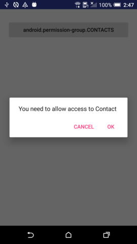

# RuntimePermission
Android RuntimePermission Example,   

permission dialog 

  

show UI with rationale of requesting this permission 

  

once user deny permission, next time will see "Nerver ask again"

open your app setting when user chose "Nerver ask again" 

# Test Device
HTC One A9, Android 6.0
 
HTC One X, Android 4.2.2

# Reference
<a href="http://inthecheesefactory.com/blog/things-you-need-to-know-about-android-m-permission-developer-edition/en" target="_blank">http://inthecheesefactory.com/blog/things-you-need-to-know-about-android-m-permission-developer-edition/en</a>
<a href="http://stackoverflow.com/questions/30719047/android-m-check-runtime-permission-how-to-determine-if-the-user-checked-nev" target="_blank">http://stackoverflow.com/questions/30719047/android-m-check-runtime-permission-how-to-determine-if-the-user-checked-nev</a>
<a href="https://developer.android.com/training/permissions/index.html" target="_blank">https://developer.android.com/training/permissions/index.html</a>

