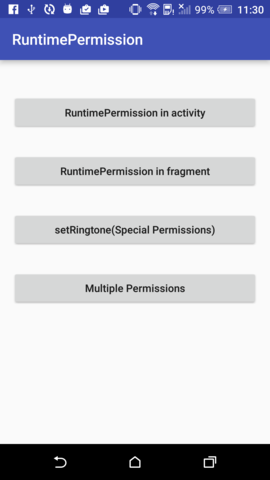
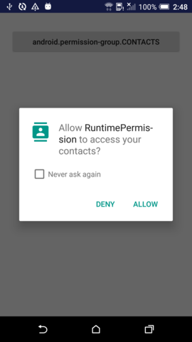
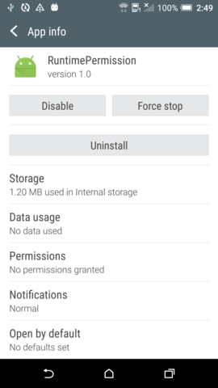
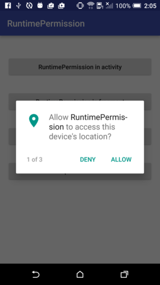

# RuntimePermission
Android RuntimePermission, example of Dangerous Permissions and Special Permissions
  
In my practical experience, I think it is better to use common activity to request permission, 
advantage of this design pattern : 
1. No need to add RuntimePermission code in every activity or fragment. 
2. If RuntimePermission code need to edit later, just edit common activity. 
3. Avoiding bugs with nested fragment(ex: <a href="https://code.google.com/p/android/issues/detail?id=189121" target="_blank">Issue 189121</a>).

  

Dangerous Permissions(Ex: in activity or fragment) and Special Permissions(Ex: setRingtone) 

  

permission dialog 

  

show UI with rationale of requesting this permission 

  

once user deny permission, next time will see "Nerver ask again" 

  

open your app setting when user chose "Nerver ask again" 

  

request multiple permissions 

  

use common activity to request permission 

# Test Device
HTC One A9, Android 6.0
 
HTC One X, Android 4.2.2

# Reference
<a href="http://inthecheesefactory.com/blog/things-you-need-to-know-about-android-m-permission-developer-edition/en" target="_blank">http://inthecheesefactory.com/blog/things-you-need-to-know-about-android-m-permission-developer-edition/en</a>
 
<a href="http://stackoverflow.com/questions/30719047/android-m-check-runtime-permission-how-to-determine-if-the-user-checked-nev" target="_blank">http://stackoverflow.com/questions/30719047/android-m-check-runtime-permission-how-to-determine-if-the-user-checked-nev</a>
 
<a href="https://developer.android.com/training/permissions/index.html" target="_blank">https://developer.android.com/training/permissions/index.html</a>
 
<a href="https://developer.android.com/guide/topics/security/permissions.html#normal-dangerous" target="_blank">https://developer.android.com/guide/topics/security/permissions.html#normal-dangerous</a>
